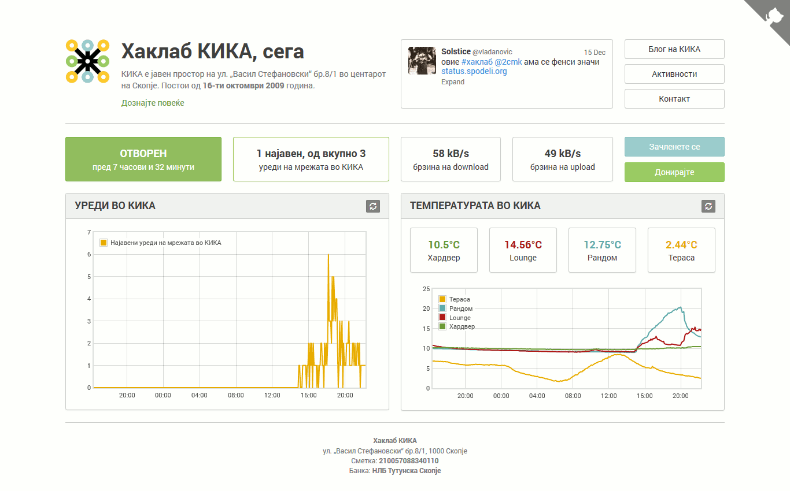

# KIKA Hacklab Status Information Dashboard



Responsive and mobile-friendly [dashboard page](http://status.spodeli.org/) with status information about [KIKA hacklab](http://b10g.spodeli.org/p/info-in-english.html), including:

* Information about whether the hacklab is currently open or closed and for how long
* The number of signed in, out of the total devices discovered in the local network
* The current Download and Upload traffic
* The current temperature in the hacklab
* A Twitter widget showing one tweet related to KIKA or Free Software Macedonia
* Graphical representation of the number of signed-in/total network devices during several past hours
* Graphical representation of the temperature registered in the hacklab during several past hours
* Information about becoming a Member of the hacklab
* Bank account information for donations
* Links to the [KIKA blog](http://b10g.spodeli.org/) and other related pages

Graphs are implemented with [Flot](http://www.flotcharts.org/) and metrics are stored in [InfluxDB](https://influxdb.com/docs/v0.9/introduction/overview.html).

### Bulding front-end assets

Run `npm install` to install all required `npm` modules, then `gulp` to rebuild all front-end assets.

**If you make changes in non-minified JS assets**, you must run `gulp` to rebuild minified versions.

### Metrics database
Metrics are currently stored in [Influxdb](https://influxdb.com/docs/v0.9/introduction/overview.html) by the scripts in [kika-info-bus](https://github.com/skopjehacklab/kika-info-bus/tree/master/influxdb-logger). Example queries:

```
curl -i -G 'https://db.softver.org.mk/influxdb/query?pretty=true' \
  --data-urlencode "db=status" \
  --data-urlencode "q=SELECT * FROM temperatures"
```

```
curl -i -G 'https://db.softver.org.mk/influxdb/query?pretty=true' \
  --data-urlencode "db=status" \
  --data-urlencode "q=SELECT * FROM landevices"
```

For the whole query language see the [influxdb documentation](https://influxdb.com/docs/v0.9/guides/querying_data.html).

Open/closed status is available at [http://hacklab.ie.mk/status/](http://hacklab.ie.mk/status/) (regex for ^status: ...$), but this might also be included in the influxdb TBBD.
